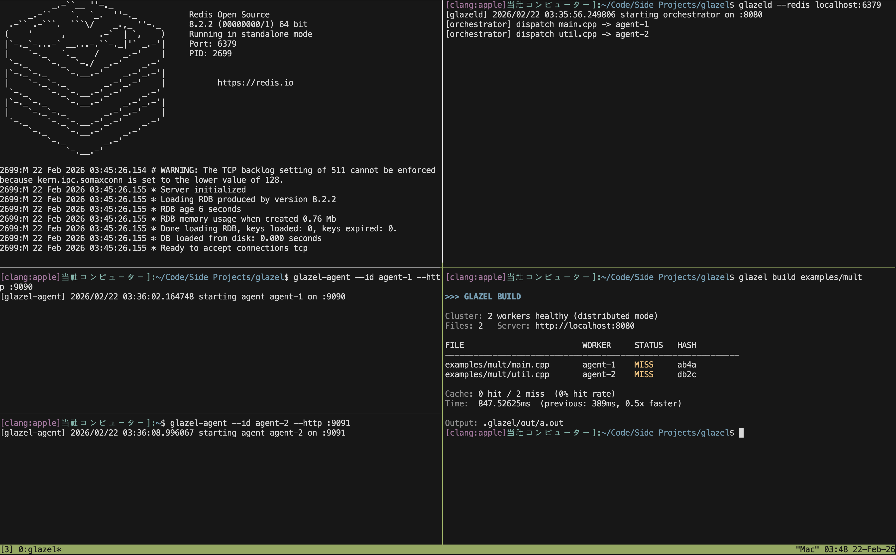
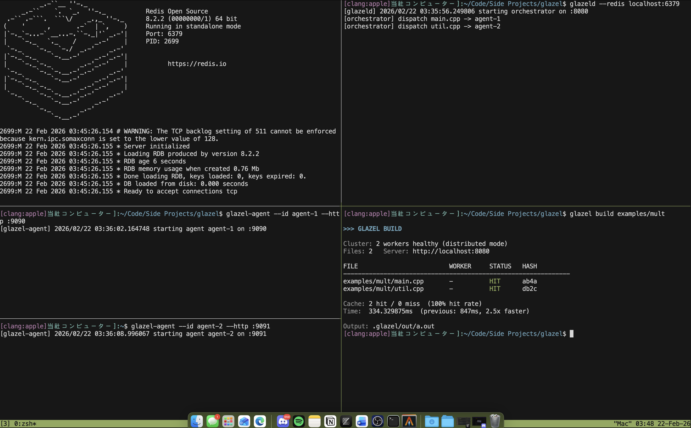

# Glazel
Distributed, content-addressable build cache for .cpp builds. (with CLI tooling)

### cache MISS ex: (build hash is not in redis)


### cache HIT ex:


---

## Architecture

```text
                        ┌────────────────────────────┐
                        │           CLI              │
                        │  glazel build ./project    │
                        └─────────────┬──────────────┘
                                      │  HTTP
                                      ▼
                        ┌────────────────────────────┐
                        │        Orchestrator        │
                        │────────────────────────────│
                        │ • Discovers workers        │
                        │ • Computes file hashes     │
                        │ • Checks cache (Redis)     │
                        │ • Dispatches MISS tasks    │
                        │ • Links final binary       │
                        └─────────────┬──────────────┘
                                      │
                    ┌─────────────────┼─────────────────┐
                    ▼                 ▼                 ▼
            ┌────────────┐    ┌────────────┐    ┌────────────┐
            │  Agent-1   │    │  Agent-2   │    │  Agent-N   │
            │────────────│    │────────────│    │────────────│
            │ Compile TU │    │ Compile TU │    │ Compile TU │
            │ Return .o  │    │ Return .o  │    │ Return .o  │
            └────────────┘    └────────────┘    └────────────┘

Redis:
• Worker heartbeats
• Cache metadata (hash → artifact)
```

---

## How It Works

1. Each `.cpp` file is hashed:

```
SHA256(file contents + compiler + flags)
```

2. If the hash exists → cache HIT → skip compile
3. If not → dispatch to available worker → compile → store artifact
4. Orchestrator links cached + compiled objects into final binary

Second builds reuse artifacts deterministically.

---

## Example

Cold build:

```
FILE         WORKER    STATUS   HASH
--------------------------------------
main.cpp     agent-1   MISS     1313
util.cpp     agent-2   MISS     518b

Cache: 0 hit / 2 miss
Time: 82ms
```

Warm build:

```
FILE         WORKER    STATUS   HASH
--------------------------------------
main.cpp     -         HIT      1313
util.cpp     -         HIT      518b

Cache: 2 hit / 0 miss
Time: 8ms  (10.2x faster)
```

---

## Running

Start infrastructure:

```
redis-server
glazeld --redis localhost:6379
glazel-agent --id agent-1 --http :9090
```

Build:

```
glazel build examples/hello
```

Inspect cache:

```
glazel cache stats
```
